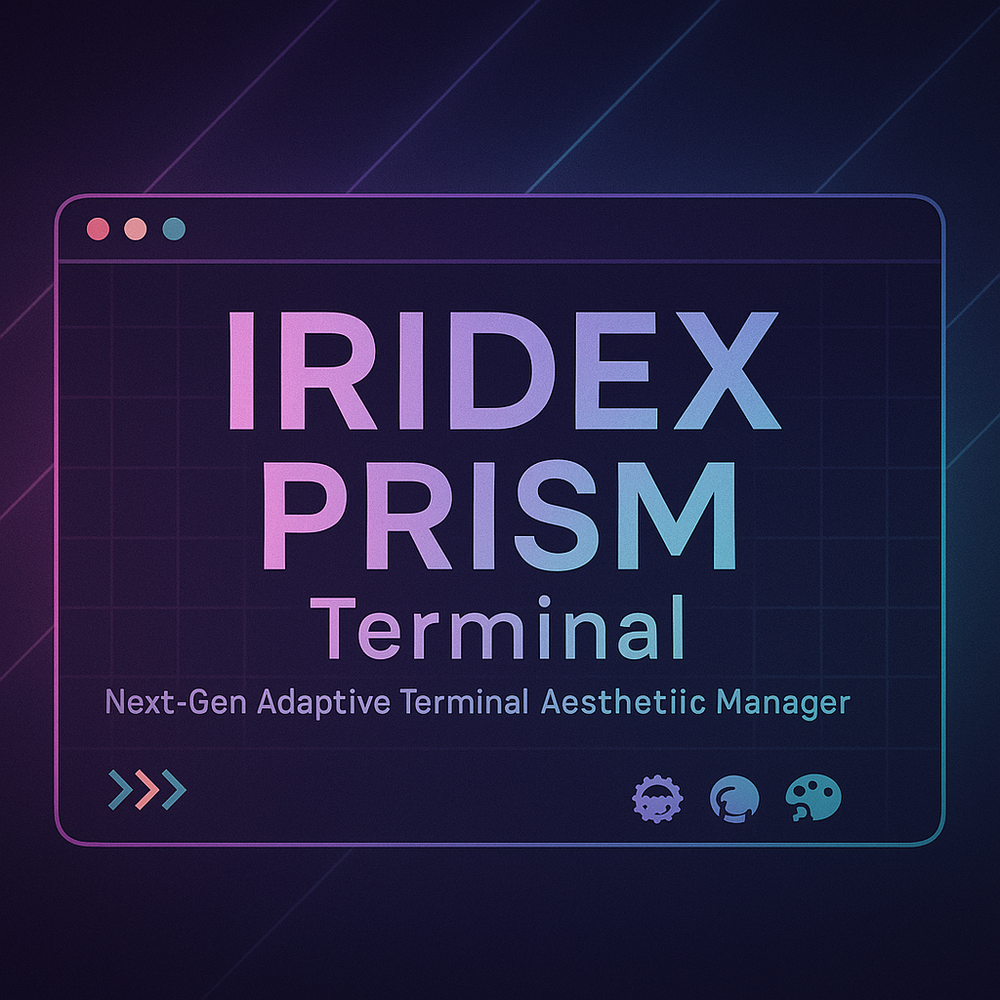

<div align="center">



<br>

# Prism Terminal

IRIDEX-powered terminal persona engine  
Neon. Glitch. Cinema. Your shell, possessed on purpose.

<!-- badges -->


</div>

---

> Prism Terminal is the IRIDEX-inspired persona engine from **ind4skylivey**. Every palette, prompt, and doc is drenched in neon, glitch, and cinematic energy so your shell feels alive, not boring.

---

## ✨ Why Prism?

- **Personas, not palettes:** Every catalog entry is a personality with intent, mood, voice, and a surprise element (animation, glyph cluster, UI twist).
- **Gallery-grade confidence:** `prism preview` opens a Ratatui-powered gallery with filters, tabs, and hotkeys (`Tab`, `j/k`, `Enter`, `a`, `E`) so you can feel a persona before applying it.
- **Multi-shell mobility:** Zsh, Fish, and Bash scripts share palettes and narratives. Your identity travels across shells without rewriting the story.
- **Release-grade rigor:** `tests/palette_schema.rs` validates every JSON palette, while `tests/theme_catalog.rs` guarantees palettes, prompts, docs, loader, and gallery stay synchronized before every release.
- **Ready for extensions:** Drop in a `themes/shared-palettes/<name>.json`, reuse the skeleton prompts, add `docs/<name>.md`, and the loader exposes your new identity automatically.

## 🚀 Install Prism Terminal

```bash
git clone https://github.com/ind4skylivey/iridex-prism-terminal
cd iridex-prism-terminal/prism
cargo install --path . --locked --force
```

For quick iterations:

```bash
cargo build --release
mkdir -p ~/bin
cp target/release/prism ~/bin/prism
export PATH=~/bin:$PATH
```

### Activation ritual

```bash
prism list
prism preview
prism apply Matrix-Shade --shell zsh
source ~/.config/prism/prism.zsh
```

Repeat `prism apply ...` for Bash/Fish (`~/.config/prism/prism.bash`, `~/.config/prism/prism.fish`) or drop the generated scripts into your dotfiles manager. The gallery keeps your shells synchronized, so you can switch personas without rewriting configs.

## 🆚 Prism vs the usual suspects

- **Starship:** blazing fast defaults but only a single config path. Prism ships a curated gallery of multi-line personalities with documented narratives, curated glyph choreography, and UI preview so you can feel the persona before enabling it.
- **Powerlevel10k:** raw configurability, yet you are dropped into a blank slate. Prism complements that by delivering ready-to-run suites (palette JSON + zsh/fish/bash prompt + docs + gallery preview) so you can explore creative aesthetics instantly.
- **Oh-My-Posh / LiquidPrompt:** flashy Windows/PowerShell theatrics. Prism is built for Ratatui, Rust, Linux/macOS workflows, multi-shell pipelines, and future-ready AI hooks—validate everything with tests, preview the entire catalog, and keep your prompts in sync.

## 🧭 Plan & the AI frontier

The living plan in `docs/PLAN.md` shows that Phase 1–6 live features are complete: core theme engine, widgets, gallery, cloud sync, CLI polish, and release readiness. Next stops:

- **Sprint 2.3 (AI focus):** Ollama integration, profile analyzer, non-LLM suggestion engine, heuristic scoring, and Smart Recommendations are marked “planned for a future release”. Soon Prism will whisper AI-assisted themes and context-aware suggestions directly inside the gallery.
- **Roadmap:** Post-v0.1.1 we will amplify context signals (git conflicts, docker/k8s cues), refine sync and widget pipelines, and polish CLI commands such as `prism export`, `prism random`, and queue-based theming.

## 🎨 Theme catalog

Each persona is a cinematic prompt:

- **Aurora-Edge** – cool blues with pink/cyan backlighting for git/docker/k8s focus.
- **Cyber-Noir** – neon Powerlevel10k layout with load/time/battery/git/docker segments.
- **ERROR_808** – glitch/noise, inverted errors, and aggressive alerts.
- **Forest-Flux** – calm greens and ambers engineered for marathon focus.
- **Glitch-Grid** – blocky layout, digital noise, and inverted palettes on failure.
- **Lavender-Core** – pastel anime-tech layers with soft glyph glows.
- **Matrix-Shade** – green-on-black hacker aesthetic with command duration and vi hints.
- **Midnight-Warp** – sleek alignment for Warp/Ghostty, optional right-hand info.
- **Mono-Quiet** – single-line cwd/git/status with crystalline monochrome accents.
- **Nebula-Mocha** – pastel powerline inspired by Catppuccin Mocha.
- **Synthwave-Void** – vivid violet/cyan neon, bold separators, arcade energy.
- **Terminal-Ghost** – almost monochrome prompt for transparent tiling.
- **Tokyo-Ghost** – vaporwave ninja single-line flow.

## 🕹️ Gallery & CLI

Prism runs like a playlist manager:

- `prism list` shows the full catalog (built-in + shared palette).
- `prism preview` loads the same catalog; use gallery hotkeys to sample, apply, and edit themes.
- `prism random` surprises you with a new persona when you need it.
- `prism apply <theme> --shell <zsh|bash|fish>` generates scripts under `~/.config/prism/` for sourcing or dotfile management.
- `prism revert --shell <zsh|bash|fish>` restores your previous prompt instantly.

## 🔧 Validation & release readiness

- `cargo test --test palette_schema` ensures every shared palette follows the schema.
- `cargo test --test theme_catalog` locks palettes, prompts, docs, loader, and gallery in harmony.
- `cargo test` runs the full suite so every persona ships polished from day zero.
